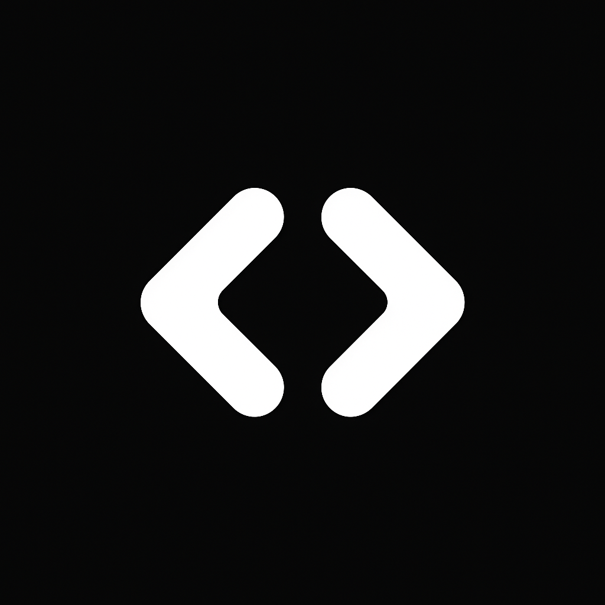

  
  Code Collab

Code Collab is a real-time code collaboration platform where collaborators can edit code, chat, and (soon) video call in shared project rooms.

In Simple <b>Code Collab is Google Meet but for Code.</b>

---

## Overview

Code Collab enables multiple collaborators to work on code files together in real time.  
It removes the need for constant pushing, pulling, or resolving merge conflicts.

This tool is ideal for:

- Developer interviews
- Learning & teaching code
- Pair programming
- Remote learning

---

## Key Features

- Room based collaboration
- Real-time code editing using Socket.IO
- Room-based project collaboration
- Live chat between room participants
- Audio and video calling (coming soon using Socket.io & WebRTC)
- Automatic syncing of code and files across all users in room

---

## Tech Stack

| Category       | Technology                                    |
| -------------- | --------------------------------------------- |
| Frontend       | Next.js (App Router), Tailwind CSS, Shadcn UI |
| Backend        | Node.js, Express.js                           |
| Database       | MongoDB (Mongoose)                            |
| Authentication | NextAuth.js                                   |
| Real-Time      | Socket.IO, WebRTC                             |
| Code Editor    | CodeMirror                                    |

---

## Contributors

Thanks to these amazing people:

- [Vikas Saini](https://github.com/vikas-saini-7) - Creator & Maintainer

Want to contribute? [Read the guide](./CONTRIBUTING.md)

## License

This project is open source and available under the MIT License.
